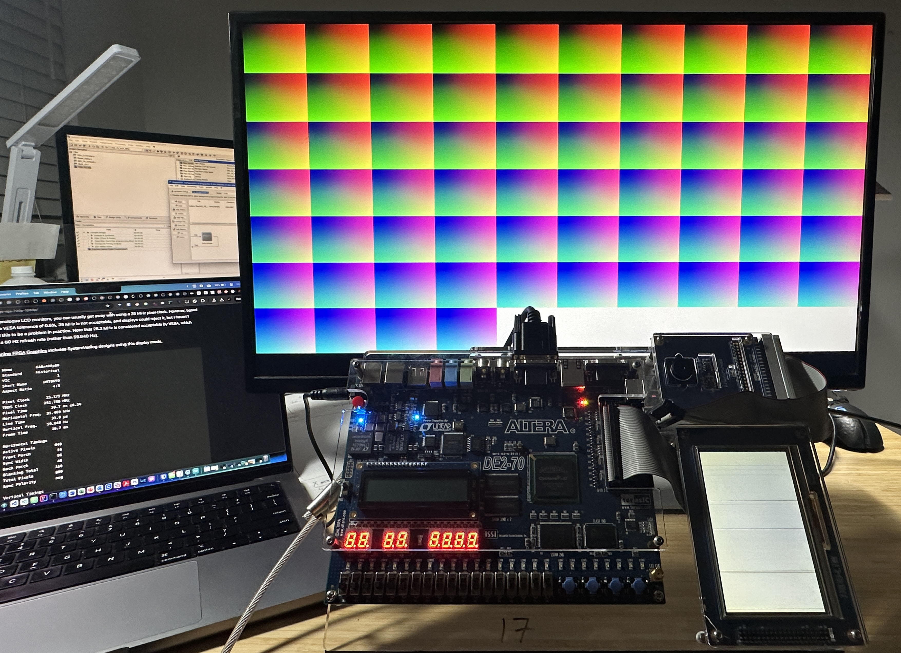

# DE2-70-Bringup
A collection of programs that brings up different elements of the terasIC DE2-70 development board.

Projects in this repository are initalized for the Altera Cyclone II `EP2C70F896C6N` FPGA.

## Guide to programming
### Quartus II setup
You need Quartus II 13.0sp1 from [here](https://www.intel.com/content/www/us/en/software-kit/662335/intel-quartus-ii-subscription-edition-design-software-version-13-1-for-linux.html). Specifically, the following items:
* Intel® Quartus® II Software (includes Nios® II EDS)
* ModelSim-Intel® Edition (includes Starter Edition)
* Intel® Cyclone®, Intel® Cyclone® II, Intel® Cyclone® III, Intel® Cyclone® IV Device Support (includes all variations)

#### Licensing:
Enroll in Intel Self Licensing [here](https://licensing.intel.com/psg/s/?language=en_US). Request a Quartus II license (free). The free license won't activate the full software for you, but will allow you access to almost everything you need.

The only issue I've run into was not having access to all of the IP modules (I am unsure if this is due to not having the paid version of Quartus or 13.0sp1 being no longer supported). You can almost get around this by copying existing IP modules used in the demo via the MegaWizard Plug-In Manager in Quartus.
* This will let you have your basic PLLs, FIFOs, and some other modules.
* As far as I can tell you will have access to all IP modules thru Qsys (now known as Intel Platform Designer) if you are integrating larger systems.

#### DPI Issues:
Quartus II 13.0sp1 is a older piece of software and might have DPI issues (UI is too small/big). You might need to override its default scaling. [Here](https://community.intel.com/t5/Intel-Quartus-Prime-Software/Wrong-font-size-in-Quartus-options-are-not-visible/m-p/1270181#M68744) is a guide on how to do this on Windows.

### Device drivers setup
With Quartus II installed, follow instructions [here](https://web.archive.org/web/20240625023825/https://www.terasic.com.tw/wiki/Altera_USB_Blaster_Driver_Installation_Instructions) to install its drivers. 

### DE2_70 Control Panel
There is a control panel that originally shipped with the DE2-70 that allowed you to control aspects of the DE2-70 without writing any HDL (ex: turn a LED on/off, write to LCD, etc.)

However it seems like it may no longer be supported (at least not on Windows 11).

The original executable is in the `DE2_70_ControlPanel_V1.6.0.zip`. Feel free to take a stab at it.

If you come across a `Load DLL (TERASIC_JTAG_DRIVE.dll) fail` error or a `Fail to connect to FPGA board` error, [this](https://community.intel.com/t5/Intel-FPGA-University-Program/control-panel-for-DE2-70/m-p/23816) post may be of use.

If you get a `Execute(<MyPath>\NiosDownloadBatch.bat) fail. ExitCode:1h` err, [this](https://community.intel.com/t5/Intel-FPGA-University-Program/DE2-70-Exit-Code-1h/td-p/65563?profile.language=es&countrylabel=Mexico) might help.

### Pin Plan Errors:
* If you get a `Can't place multiple pins assigned to pin location Pin_AD25` during your first time in Pin Planner, see: https://community.intel.com/t5/Programmable-Devices/error-with-pin-assignment/td-p/23523

## Overview of Directories
`DE2_70_Basic_Tests` - My first attempt at programming the board. It is a basic switch inverts LED example.
* Top Level File: `BasicTests.v`

`DE2_70_Ethernet` - Work In Progress - An attempt at a HTTP server using the Nios II softcore and assorted IP modules via Qsys.

`DE2_70_VGA` - My old (non-functional) attempt at a VGA Controller with extensive simulation logs. It seems like the Quartus project is corrupted as I was able to successfully bring up VGA in another project with the exact same code.

`DE2_70_VGA_NEW` - Functional 640x480 @ 60Hz VGA controller with 18-bit color support. Implemented using both a 50 MHz mod-2 clock divider and a PLL (28 MHz -> 25.2 MHz).
* Top Level File: `VGA_Draw.v`

`DE2_70_ControlPanel_V1.6.0.zip` - Zip file containing the DE2-70 Control Panel executable.

`DE2_70_demonstrations_V10.rar` - Contains a series of board demos written by terasIC that shipped on a CD with the board originally.

`DE2_70_VIDEO_V1.2.0.zip` - A video (and possibly camera) demo written by terasIC that originally shipped with the board on a CD.

## Simulation
Simulations in this repo are run on ModelSim Altera Starter Edition, which is included when downloading Quartus II.
* ModelSim User Manual [here](https://faculty-web.msoe.edu/johnsontimoj/Common/FILES/modelsim_user.pdf)
    * The Verilog states on pg. 303 is particularly helpful.

## Some additional information
### VGA Controller Notes
Notes and resources I used for writing the VGA controller can be found in [VGA_Controller.md](VGA_Controller.md).

### A quick historical note: Where did I get these boards from / Where did these boards come from?
This section will make more sense for UC Berkeley (mainly EE/CS) folks.

I have been told that these are the old FPGAs from the [EECS 151](https://www.eecs151.org/) class (presumably the FPGA lab). However I don't know the timeframe when these boards were used.

From what I can gather:

The previous class that eventually led to EECS 151 is [CS150: Components and Design Techniques for Digital Systems](https://inst.eecs.berkeley.edu/~cs150/archives.html) and it seems like the class switched to the Xilinx® ML505 board (XUPV5-LX110T FPGA) in Spring 2009 (See slide 11 [here](https://inst.eecs.berkeley.edu/~cs150/fa10/Lab/Lab1/LabLecture1.pdf#11)) and has been using that until 2018 when the class changed name to EECS 151 and switched to using the PYNQ-Z1 (up to present present day as of 2024). [Here - slide 30](https://inst.eecs.berkeley.edu/~eecs151/sp18/files/Lecture1.pdf) provides a good overview of the boards used and projects done over the years of the course.

Before the ML505 board, they were using a (custom designed?) board by Xilinx called CaLinx that used the Virtex E FG680 FPGA (schematics [here](https://inst.eecs.berkeley.edu/~cs150/Documents/CaLinx2_Schematics.pdf)) up until Spring 2009.

So I am not exactly sure what/when these boards were used. Berkeley is enrolled in the [terasIC university program](https://www.terasic.com.tw/cgi-bin/page/archive.pl?Language=English&No=329) however the course listed is a physics course and the board used is the DE2-115, not the DE2-70.

I got access to these boards via [Berkeley IEEE](https://ieee.berkeley.edu/) and I was able to take one for the summer and experiment with it.

### Other resources
A video on getting started with Quartus II (setting up projects, compilation, pin planning, etc.): [here](https://www.youtube.com/watch?v=uPuui9ZhZk8).
* [Here's](https://www.youtube.com/watch?v=oAS8UTtZ3_w&list=PLMonDzz7J8Sk8RD3lap1iBZI3leIPk7wF&index=8) another one that is a bit more clear