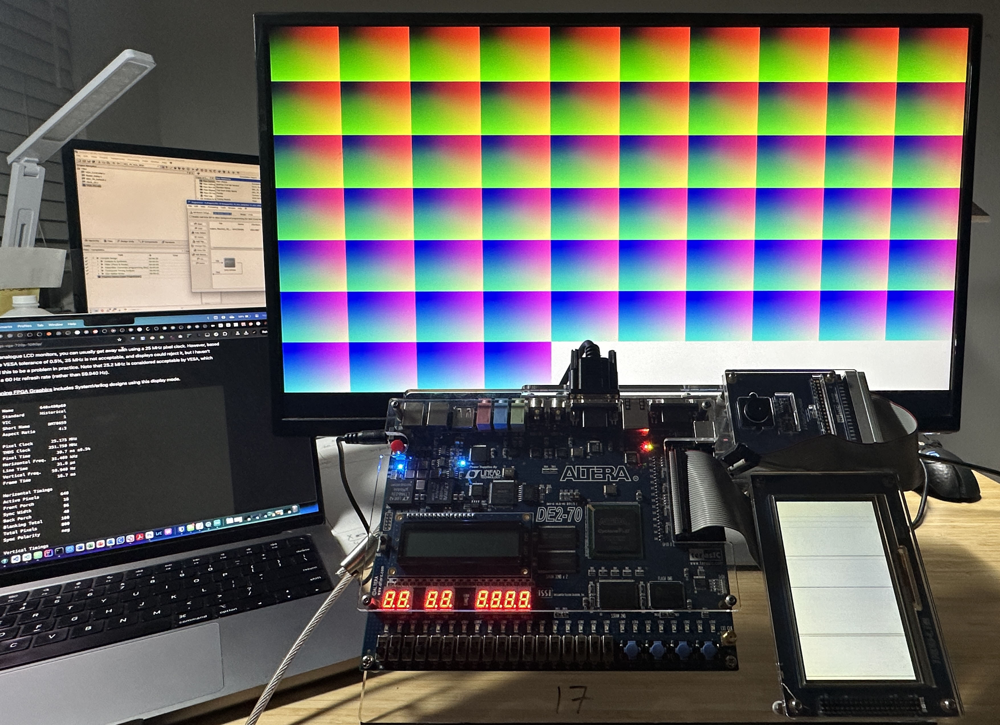

# VGA Controller Resources
Resources used to implement a 640x480, 60 Hz, 18-bit color VGA controller.

## Specification & Timings
The technical specifications used to implement the controller are from Project F here: https://projectf.io/posts/video-timings-vga-720p-1080p/#vga-640x480-60-hz

The timings (µs & ms) for front & back porches, HSYNC & VSYNC are from TinyVGA: http://tinyvga.com/vga-timing/640x480@60Hz

VGA 640x480 uses negative polarity for HSYNC & VSYNC. The meaning of this is explained here: https://electronics.stackexchange.com/questions/522053/what-does-it-mean-positive-or-negative-polarity-in-vgas-hsynch-and-vsynch

Blacking is supposed to be on during front & back porches: https://electronics.stackexchange.com/questions/498338/are-the-front-and-back-porches-required-to-be-black-for-vga

## VGA Guides
General guidance from Project F: https://projectf.io/posts/fpga-graphics/

Data sheet for the ADV7123 Triple 10-Bit High Speed Video DAC used by the DE2-70 dev board: https://www.analog.com/media/en/technical-documentation/data-sheets/ADV7123.pdf (see pg. 10)
    * This will help with implementing some specifics for the board: what blank should be, what sync should be, etc.

### Implementing a Clock Divider
This slide from George Mason University's ECE 448 outlined the general block diagram for implementing VGA with a mod-2 clock divider: https://people-ece.vse.gmu.edu/coursewebpages/ECE/ECE448/S18/viewgraphs/ECE448_lecture10_VGA_1.pdf
* A guide on writing a mod-2 clock divider: https://embeddedthoughts.com/2016/07/29/driving-a-vga-monitor-using-an-fpga/

 

#### Clock Divider: Reset Signals
Writing my own clock divider means wiring up my own reset signals. Here are some resources I followed:
https://www.reddit.com/r/FPGA/comments/126zzqg/reset_best_practice/

* Checking whether a reg or wire is `xxx`: https://stackoverflow.com/questions/24465776/how-to-check-unknown-logic-in-verilog

How reset signals are interpreted by FPGAs: https://www.reddit.com/r/FPGA/comments/vo61pw/beginner_question_how_to_connect_reset_signals/

### 18-bit Color Test
Partial inspriation for how to do the color test came from the following resources:
* https://people.ece.cornell.edu/land/courses/ece4760/RP2040/C_SDK_vga256/index_vga_256.html
* https://medium.com/@jeremysee_2/designing-a-24-bit-vga-adapter-acbcccd3258e
* https://en.wikipedia.org/wiki/List_of_monochrome_and_RGB_color_formats#18-bit_RGB
* https://en.wikipedia.org/wiki/List_of_monochrome_and_RGB_color_formats#/media/File:16777216colors.png
* And many colorhexa experimentations.

### Additional resources that I didn't use but found along the way that may be helpful:

Example from Intel: https://www.intel.com/content/dam/support/us/en/programmable/support-resources/fpga-wiki/asset03/basic-vga-controller-design-example.

Slide deck from Milwaukee School of Engineering's EE 3921 acts as a good TL;DR: https://faculty-web.msoe.edu/johnsontimoj/EE3921/files3921/vga_basics.pdf

## Common Errors/Issues:
A collection of some of the errors/issues I ran to and resources to help resolve them.

* Monitor acquires signal but displays blank/black screen (only backlight is on): Likely some issue with the timings (but not with the clock). For me, this was because my X coordinate & Y coordinate calculations, and therefore my HSYNC, VSYNC & Blanking was 1 cycle behind due to doing `some_var <= some_var + 1` in Verilog, then using `some_var` and expecting it to have the updated value in the same cycle. In reality, `some_var` won't have the updated +1-ed value until the next cycle.
    * Thank you to `.Piasa` on the Digital Design HQ Discord for helping me figure this issue out! For more information, see their post on the [Digital Design HQ Discord](https://discord.gg/kQVXXC8rWv) and then click on [this link](https://canary.discord.com/channels/545823859006242826/709779445845721199/1253873210181554298) to go to the post.

* Monitor displays the right colors (vaguely) but there are noise lines going up and down the screen and the colors are faded and/or whites look like grays: This is likely due to not enough voltage being put out thru the VGA pins. In my case, it was due to my RGB integers not being 10-bits (the size I defined my RGB regs to be). If you defined your RGB reg as `[9:0]`, your white color should be at least `r = 512, g = 512, b = 512`.

* Successful compile in Quartus but 0 combinational logic used: You likely left out a clock or a reset has been permanently left on. Quartus synthesizer has determined that "an empty FPGA would do exactly the same thing that what you described." - See: https://community.intel.com/t5/Intel-Quartus-Prime-Software/Help-Compilation-Successful-but-zero-logic-element-used/m-p/53426#M11037

* Counter value producing StX during sims: The value for the reg undefined. - See: https://stackoverflow.com/questions/69047231/why-is-my-counter-out-value-producing-stx

* `Error (10028): Can't resolve multiple constant drivers for net` during sims: You cannot drive the same wire/reg from 2 `always` blocks. - See:
    * https://stackoverflow.com/questions/21061596/error-10028-cant-resolve-multiple-constant-drivers-for-net-vhdl-error
    * https://stackoverflow.com/questions/35929465/verilog-multiple-constant-drivers

* `Illegal reference to net`: likely a problem with not declaring outputs as reg. - See: https://stackoverflow.com/questions/29340394/error-vlog-2110-illegal-reference-to-net